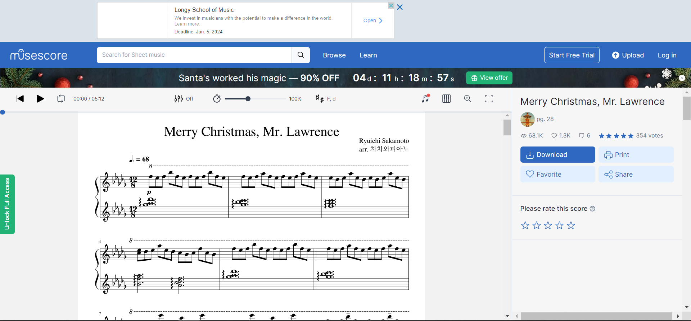
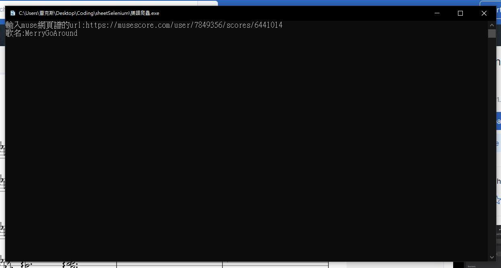
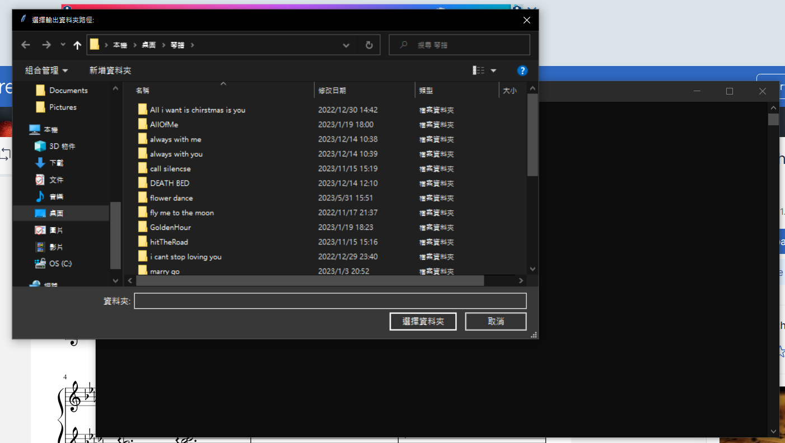
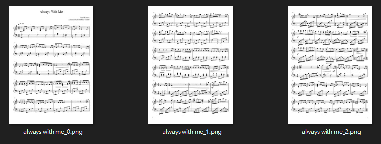

# 樂譜爬蟲

[**點我下載程式ZIP檔**](https://github.com/ttdragon0722/sheetSelenium/releases/download/download/sheetDriver.zip)

## 使用指南
* **找到你想抓的樂譜**

* **複製鏈結並貼上**
* **命名樂曲名稱(這會成為你的圖片名稱及資料夾名稱)**

* **選擇輸出資料夾**

* **完成**
